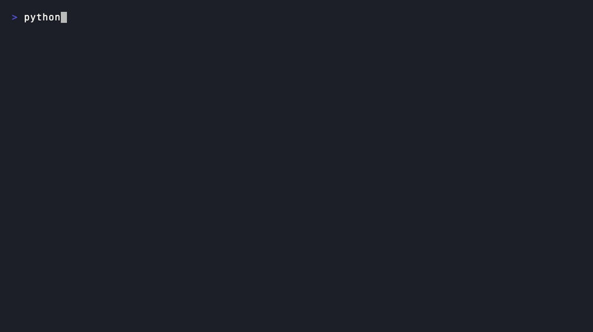
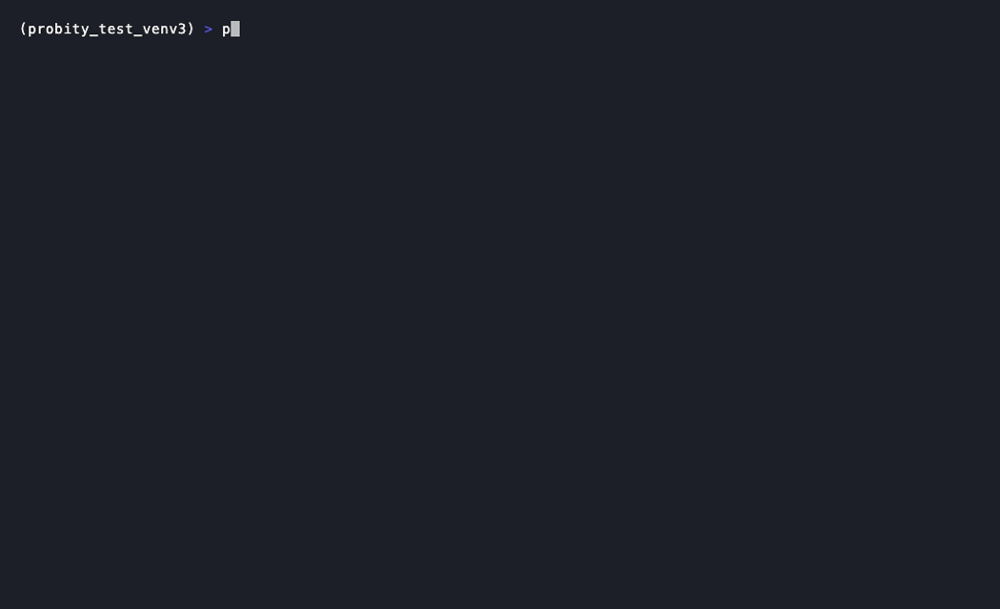

# Probity

[](https://github.com/eikiyo/probity/actions/workflows/ci.yml)
[](LICENSE)
[](https://www.python.org/)



LLMs are fundamentally probabilistic. Ask one the same question twice and you can get two
different answers — that's not a bug, it's how sampling works. Most of the time that's fine. It is
**not fine** when the question is "is this a pre-money or post-money valuation" and the answer
decides who owns what in a startup financing. Finance needs determinism; LLMs supply probability.
Nobody was measuring that gap, so Probity does: it benchmarks how often a model's answer *wobbles*
on real term sheets, charters, SAFEs, convertible notes, and cap tables — before you ever get to
whether the answer is right.

- **Wobble** (the core metric) — does the model give the *same* answer when you ask it the same
  question 20 times at temperature 0.7? A model whose answer flips run to run cannot be trusted in
  a workflow that touches money, even when it is often right. This is label-free: it needs no
  ground truth, only repetition.
- **Accuracy** — does the model get the answer *right*, graded against a validated answer that a
  human extracted from the source document (not authored by an AI)?

These are scored separately and never averaged into one headline — a model can be perfectly
consistent and consistently wrong. Models are run across a **size ladder** (1B local, then a
hosted OpenRouter lineup spanning ~12B to 120B+) to test whether wobble falls as capability rises.
A 27B local model is reserved for a separate comprehensive sweep once every test is built.

## Quickstart

### Option A — install the package (fastest way to run a real benchmark yourself)

```bash
pip install probity-bench
probity-bench onboard   # pick documents to fetch, models to run, and store your API key(s)
```

`onboard` is a guided wizard — same idea as `openclaw onboard` or `claude setup`: it walks you
through which leaves to pull real SEC documents for, which models to benchmark (auto-detects local
Ollama models; DeepSeek/Gemini for hosted), and collects + **verifies** any API key by making one
real call before it lets you proceed. Everything is stored locally at `~/.probity/` — nothing
leaves your machine except the model calls you explicitly configure.



The package ships the **full pipeline** — `engine/`, all 60 leaves' code, oracles, and prior
results — everything except the raw SEC documents themselves (fetch those via `onboard` or
`source.py`, per leaf) and, obviously, no model weights (those come from Ollama/DeepSeek/Gemini).

```bash
probity-bench demo       # zero-config: replay a real wobble example, no install/network needed
probity-bench results    # print the 2 summary tables from bundled scored.json
probity-bench list       # every leaf + whether you've fetched its corpus
probity-bench run <leaf> # fetch (if needed) + benchmark one leaf with your configured models
```

### Option B — clone the repo (full reproducibility, no package boundary)

```bash
git clone https://github.com/eikiyo/probity.git
cd probity
make setup     # runs the test suite + regenerates results/RESULTS.md + this README's tables from disk
```

That's it — zero third-party dependencies, pure Python 3 stdlib, no network call, no API key.
(No `make`? `python3 -m unittest discover -s tests && python3 results/render.py` does the same thing.)

To **re-run a test yourself** against live models (needs [Ollama](https://ollama.com) running
`gemma3:1b` locally + a DeepSeek API key — see [`.env.example`](.env.example)):

```bash
cp .env.example .env && set -a && source .env && set +a
cd leaves/vesting_schedule       # or any other leaf under leaves/
python3 source.py                # fetch the real SEC documents into corpus/
python3 run.py                   # run the model ladder, N=20 each, writes scored.json
python3 ../../results/render.py  # regenerate the tables with your fresh numbers
```

## Benchmark results

<!-- BENCHMARK:START -->
*60 tests, each item run 20x/item at temp 0.7 across a ladder of 12 models. **Wobble** (lower = better) is the run-to-run inconsistency rate, weighted by item count across every test that model ran; the per-category table below averages across all 12. Full per-test breakdown (all 60 tables): [`results/RESULTS.md`](results/RESULTS.md).*

### Does reliability improve with model size?

| Model | Size | Tests covered | **Wobble** ↓ | Accuracy |
|---|---|---|---|---|
| `gemma3:1b` | 1B, local | 60 |  |  |
| `deepseek-v4-flash` | hosted, direct | 60 |  |  |
| `deepseek-v4-pro` | hosted, direct | 60 |  |  |
| `gemma-4-31b-it` | 31B, hosted (OR) | 60 |  |  |
| `mistral-large-2512` | hosted (OR) | 60 |  |  |
| `minimax-m2.5` | hosted (OR) | 60 |  |  |
| `llama-3.3-70b` | 70B, hosted (OR) | 60 |  |  |
| `gemma3:1b-it-qat` | 1B QAT, local | 60 |  |  |
| `gemini-3-flash` | hosted (OR) | 60 |  |  |
| `claude-haiku-4.5` | hosted, direct API | 60 |  |  |
| `gpt-oss-120b` | 120B, hosted (OR) | 60 |  |  |
| `gpt-5-mini` | hosted (OR) | 60 |  |  |

### By fundraising-document category

| Category | Tests | **Wobble** ↓ (all models) | Accuracy (all models) |
|---|---|---|---|
| Priced equity rounds | 16 |  |  |
| SAFEs & convertible notes | 12 |  |  |
| Cap table math | 7 |  |  |
| Investor rights & governance | 7 |  |  |
| Founder & employee vesting | 5 |  |  |
| Regulatory disclosures | 5 |  |  |
| Off-market risk flags | 5 |  |  |
| Exit waterfalls | 3 |  |  |

<!-- BENCHMARK:END -->

Full per-item breakdown — including which clauses make each model wobble — in
[`results/RESULTS.md`](results/RESULTS.md).

## Why the answers are trustworthy

Most LLM benchmarks in niche domains are built from synthetic data with synthetic answers. That has
a hidden flaw: if an AI writes both the question and the answer key, the answer key can be wrong in
exactly the ways the model under test is wrong. Probity avoids this with a strict **oracle layer**:

1. **Source a real document** that contains the ground truth in its own authoritative text — for
   example, a Certificate of Incorporation filed with the SEC that states, in legally precise
   language, whether its preferred stock is participating.
2. **A human separates the question from the answer.** The model sees only the clause (the question).
   The validated label, plus the exact quote that proves it, is stored in a separate oracle file the
   model never sees. Items whose answer cannot be determined with confidence are *excluded*, not guessed.
3. **Run only the question** through each model, N times, and score the majority answer against the
   validated label.

Synthetic instantiation is used only to *multiply* difficulty (varying numbers, off-market terms,
ambiguous phrasing) on top of a real, human-validated seed — never as the sole source of truth.

## The test map

Probity's full test backlog is a structured map of fundraising-reasoning capabilities
(`engine/registry.json`) — 67 atomic checks across priced equity, convertibles, cap-table math,
exit waterfalls, investor rights, founder equity, regulatory filings, and off-market risk flags.
Each check is built one at a time, to depth, against real sourced documents.

## Structure

```
engine/    the model-agnostic core: clients, run harness, normalizer, reliability+accuracy scorers
leaves/    one folder per test, each with its real-document corpus, its separated oracle, and its runner
results/   the living benchmark table
```

See the [Quickstart](#quickstart) above for the full clone → run → reproduce path.

## Contributing

Bug reports, new leaves, and sourcing improvements are welcome — see
[CONTRIBUTING.md](CONTRIBUTING.md). Security issues: see [SECURITY.md](SECURITY.md), never a
public issue.

## License

MIT — see [LICENSE](LICENSE).
